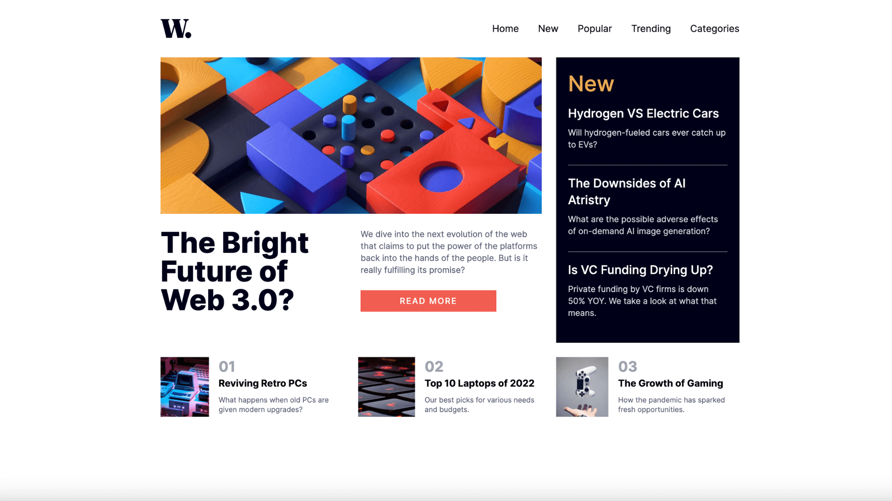

# News homepage solution | Next.js, TypeScript and Tailwind CSS

This is a solution to the [News homepage challenge on Frontend Mentor](https://www.frontendmentor.io/challenges/news-homepage-H6SWTa1MFl).

## Overview

I solved this challenge using Next.js, TypeScript and Tailwind CSS.

The constituent parts of the page are broken down into relevant components for modularity and reusability.

### The challenge

Users should be able to:

- View the optimal layout for the interface depending on their device's screen size
- See hover and focus states for all interactive elements on the page

### Screenshot Preview

### Links

- Live Site URL: [https://news.adamrichardturner.dev/](https://news.adamrichardturner.dev/)

## My process

### Built with

- [React](https://reactjs.org/) - JS library
- [Next.js](https://nextjs.org/) - React framework
- [Tailwind CSS](https://tailwindcss.com/) - For styles
- [TypeScript](https://www.typescriptlang.org/) - For programming
